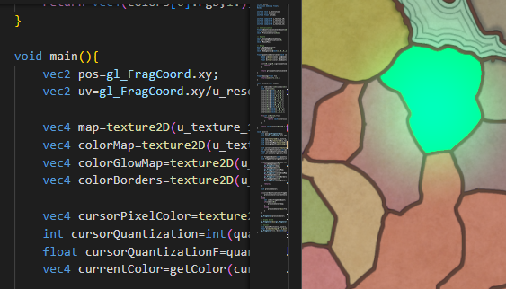
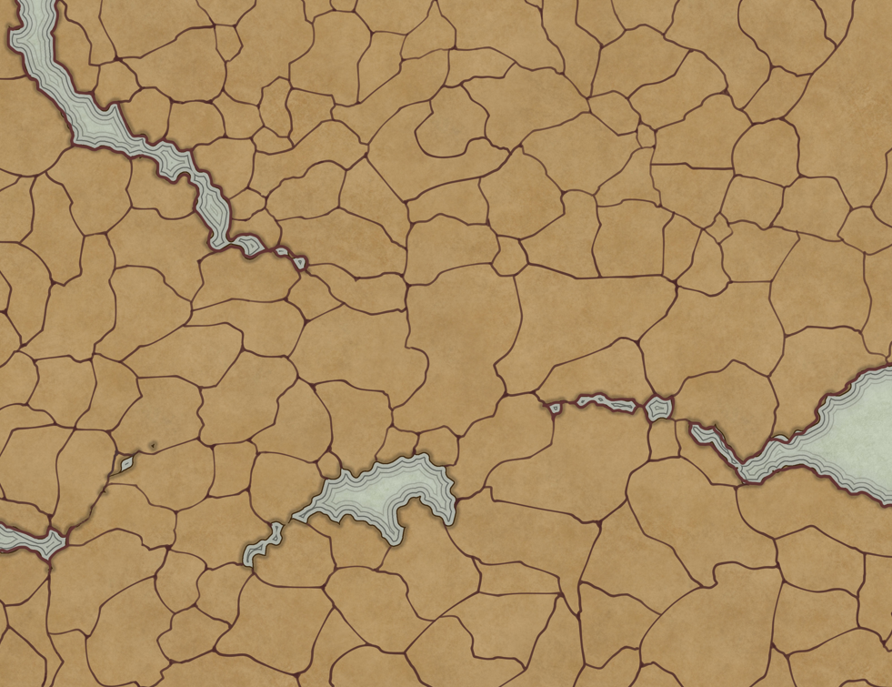
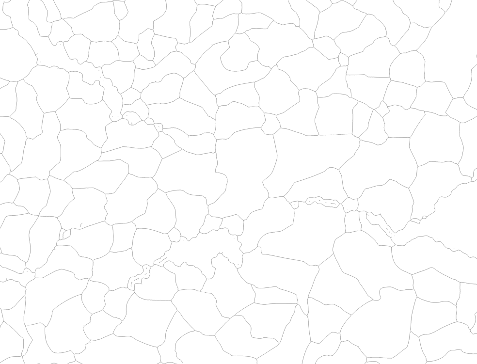
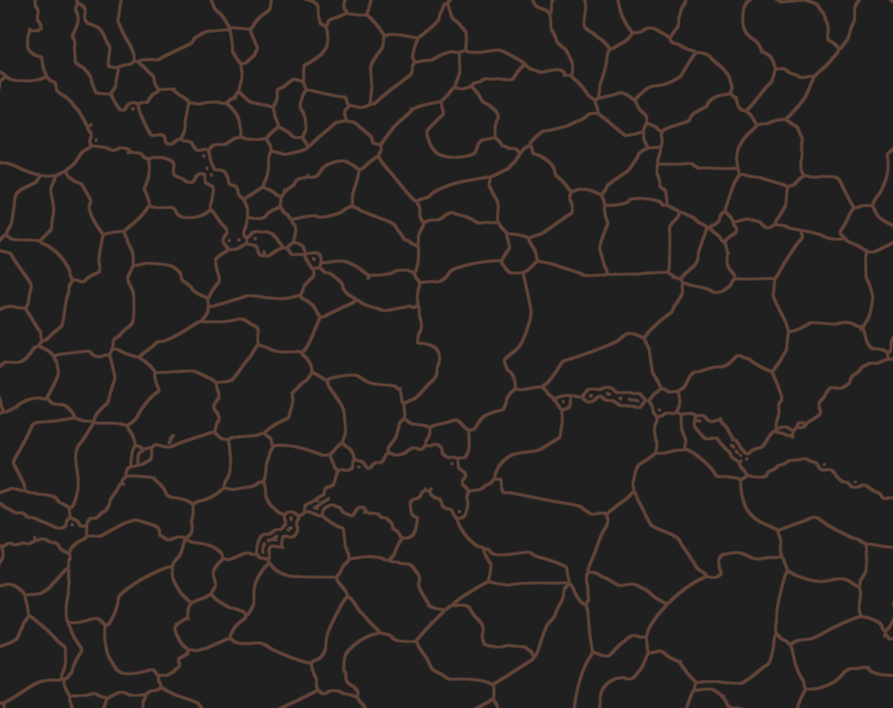
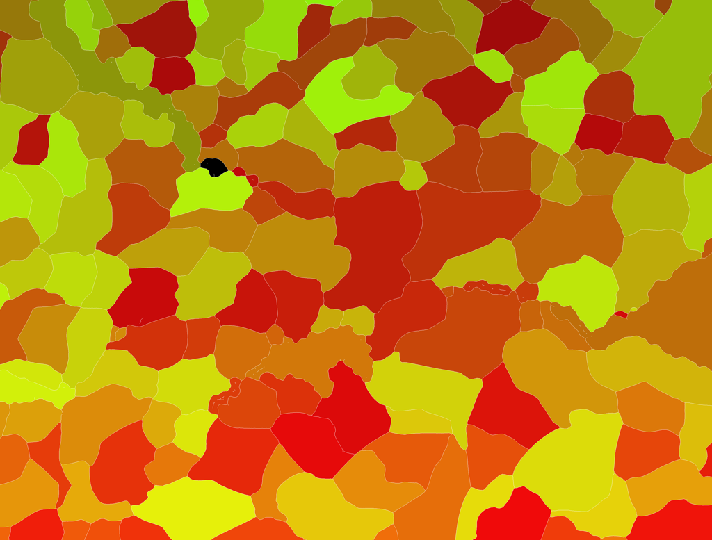
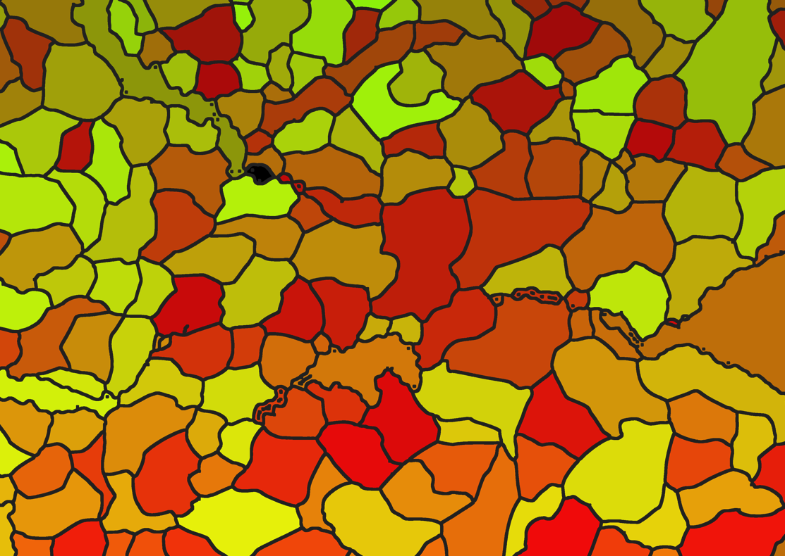
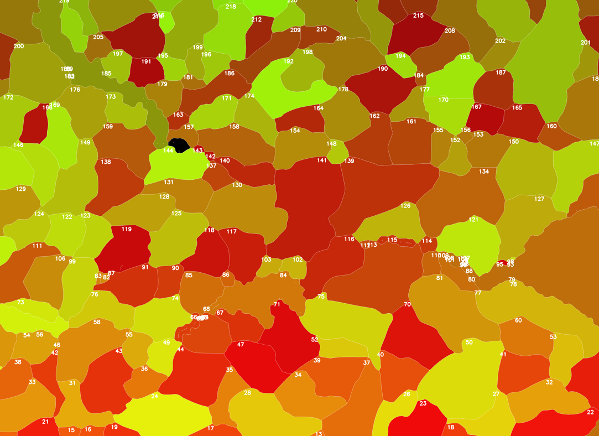

Boilerplate project with a set of tools to quickly draft fragment shaders and produce assets for shaders.  
 It serves a dual purpose: first, to offer an accessible playground for developers - including those unfamiliar with shader programming - who can fork the project and start experimenting; and second, to support creative exploration of map shader creation, with tools and examples that include OpenCV-based image processing for generating custom visual inputs.

# Shaders

They are located in the `./shaders` folder. The purpose is to be able to do quick draft and experimentations.

### How ?  

    > Show glslcanvas

### Args :
- u_time: a float representing elapsed time in seconds.
- u_resolution: a vec2 representing the dimensions of the viewport.
- u_mouse: a vec2 representing the position of the mouse, defined in Javascript with .setMouse({x:[value],y:[value]).
- u_texture_[number]: a sampler2D containing textures loaded with the data-textures attribute. (cf settings "glsl-canvas.textures")

### Doc :  
- https://github.com/actarian/glsl-canvas

### Extensions :
- glsl-canvas
- glsl lint
- shader languages support for vscode

### Tools :
- https://github.com/KhronosGroup/glslang/releases -> to use glsl lint

# Image Processing

Using OpenCV to produce assets for shaders

## Concepts
-   Skeletonisation
-   Edge detection
-   Line thinning
-   Noise reduction
-   Morphological operations :
    -   Erosion
    -   Dilatation
    -   Opening
    -   Closing
-   Connected Component Analysis: (on the skeletonized image), will label each separate area of the background (including the holes) with a different number.
    -   Labeling
    -   Filtering
    -   Count holes
    -   Fill holes

## Setup

### Extensions
-   Python v2023.6.1 -> provided the installations for Pylance and Jupyter
-   Python Image Preview

### Libs
-   pip install opencv-python
-   pip install Pillow
-   pip install matplotlib
-   pip install scikit-image

## Shader Map Generation

`./scripts/shader_map_generation` : set of notebooks and basic image operations to produce shader assets. 

The process is different for each images. `map_image_processing_template.ipynb` is a template that can be used as a basis for asset generation.

**Example** 

We can achieve this effect:

Using only this image:

By generating these assets using OpenCV:

